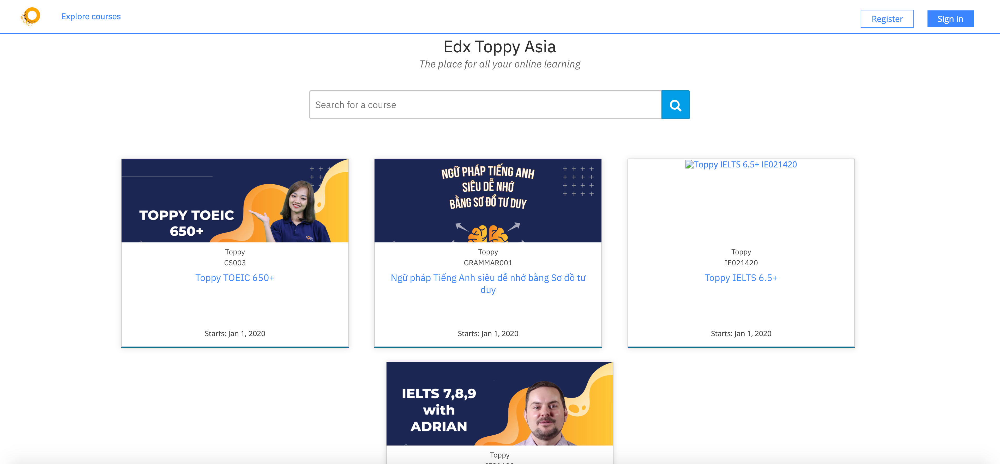

Toppy, a cool blue theme for Open edX
======================================

Toppy is an elegant, customizable theme for `Open edX <https://open.edx.org>`__.

Installation
------------

Clone the theme repository::

    git clone https://github.com/gstearmit/toppy-edx-theme

Render your theme::
    
    tutor config render --extra-config ./toppy/config.yml ./toppy/theme "$(tutor config printroot)/env/build/openedx/themes/toppy"

Rebuild the Openedx docker image::

    tutor images build openedx  openedx-dev

Restart your platform::
    
    tutor local start -d

or    tutor local quickstart
    
You will then have to enable the "toppy" theme, as per the `Tutor documentation <https://docs.tutor.overhang.io/local.html#setting-a-new-theme>`__::
    
    tutor local settheme toppy localhost studio.localhost \
        $(tutor config printvalue LMS_HOST) $(tutor config printvalue CMS_HOST)

Customization
-------------

A few settings in the theme can be easily customised: this includes the theme primary color, landing page tagline, footer legal links.
Theme settings are defined in the `config.yml <https://github.com/gstearmit/toppy-edx-theme/blob/master/config.yml>`__ file at the root of the repository.
You can override all or part of those settings by creating you own ``config-custom.yml`` file. Then, render the theme with::
    
    tutor config render \
        --extra-config ./toppy/config.yml \
        --extra-config ./toppy/config-custom.yml \
        ./toppy/theme "$(tutor config printroot)/env/build/openedx/themes/toppy"

License
-------

This work is licensed under the terms of the `GNU Affero General Public License (AGPL) <https://github.com/gstearmit/toppy-edx-theme/blob/master/LICENSE.txt>`_.